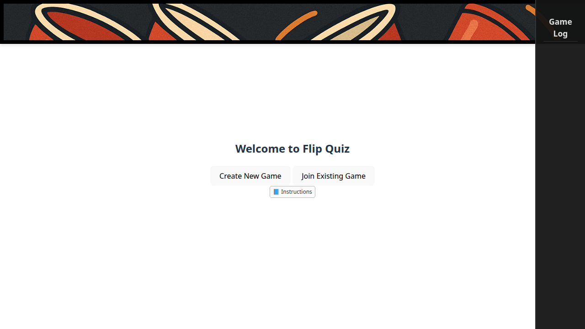
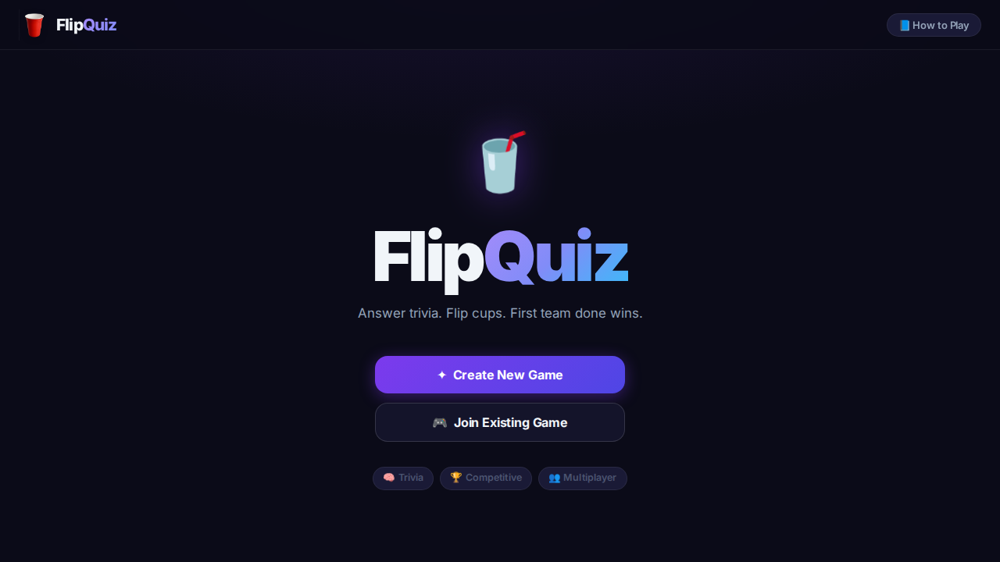
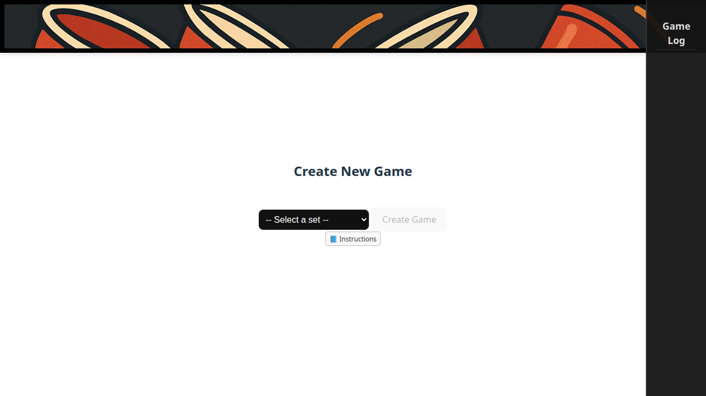
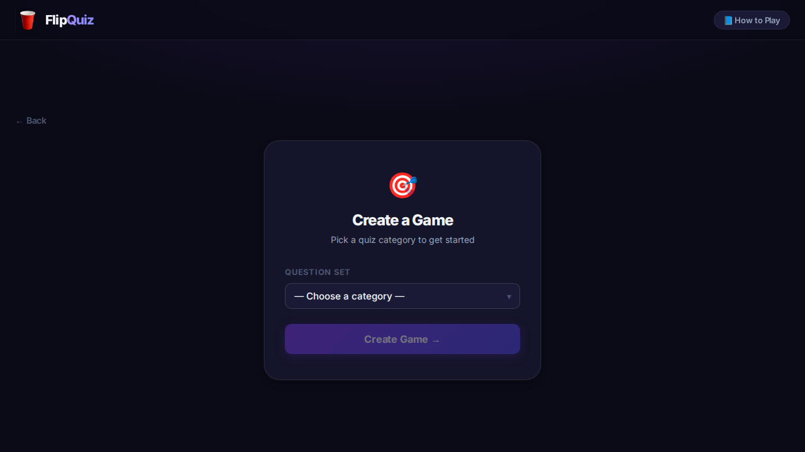
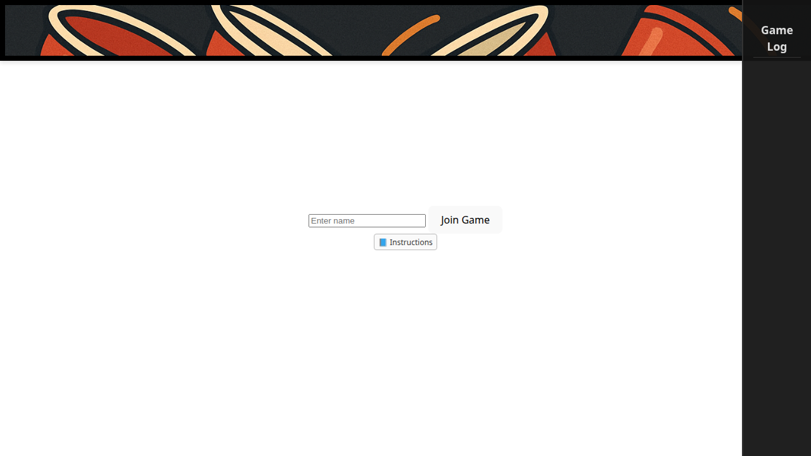
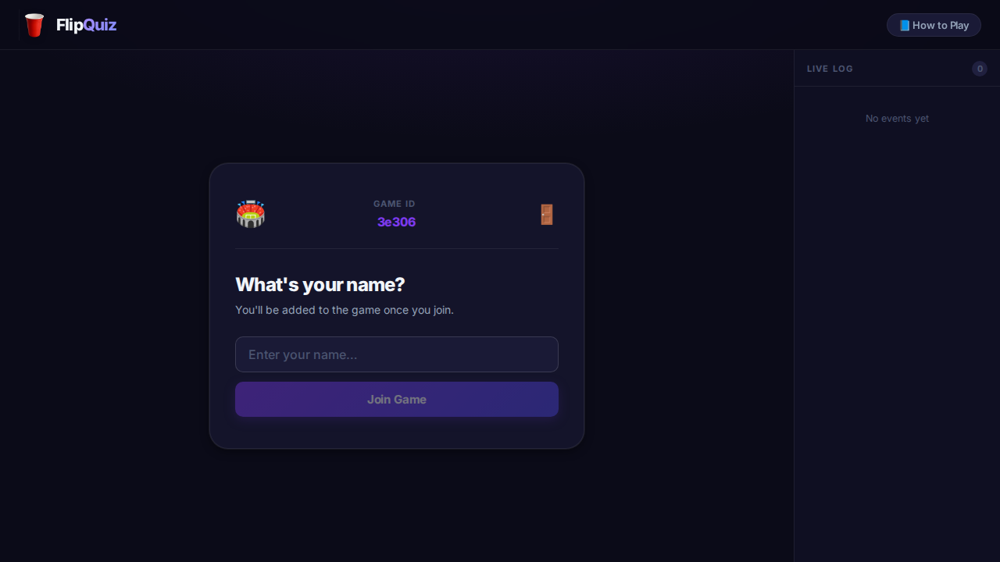
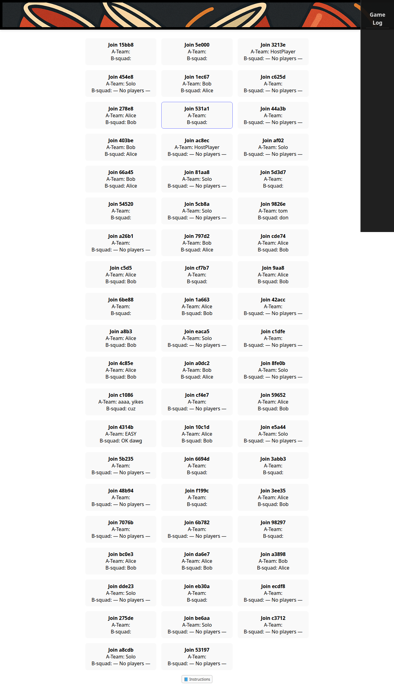
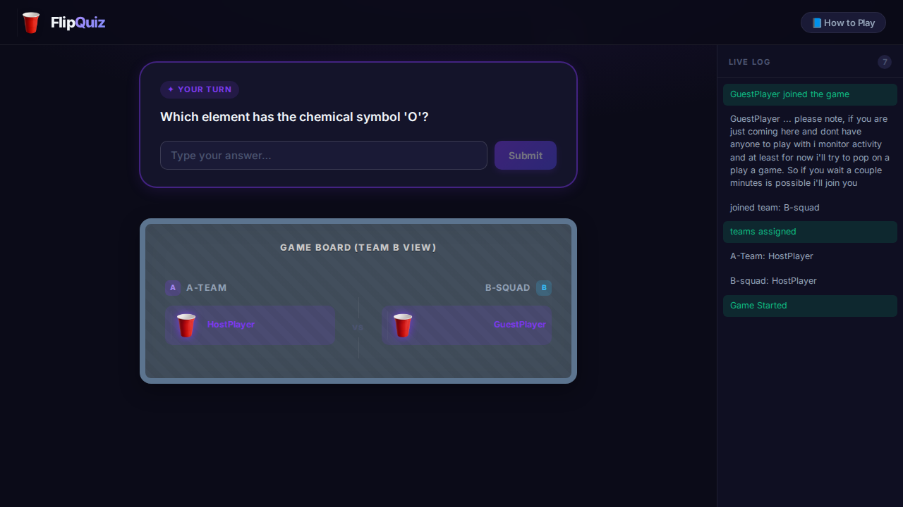

# AI-Assisted Development Approach

This document explains how GitHub Copilot has been used in FlipCup, both for the original product work and for later engineering/operations work around testing, deployment, and documentation.

## Overview

The important detail is that Copilot was not only used to generate code. Across the project it has also been used to:

- inspect the codebase and identify weak spots
- implement UI and backend changes
- write and debug Playwright coverage
- wire GitHub Actions workflows
- help shape staging deployment on the homelab
- document architecture, deployment, and repo usage
- draft PR bodies, follow-up explanations, and review artifacts

In other words, the AI contribution in this repo has been broader than "generated a few files." It has included implementation, validation, ops wiring, and project documentation.

## The original major Copilot-assisted push: PR #6

The first major documented Copilot-led wave landed in [PR #6](https://github.com/richvigorito/flip-cup/pull/6): a frontend redesign, reconnect hardening, stale-game cleanup, expanded E2E coverage, CI automation, and the PR artifacts themselves.

### What PR #6 actually shipped

Although the branch started as a UI redesign, the merged PR ended up covering more than styling.

| Area | What changed |
|------|--------------|
| UI | Full visual redesign of the Svelte frontend with a "garage / folding table" feel |
| Frontend state | Reworked team-state handling with a derived `myTeam` store so players see the correct board perspective |
| WebSockets | Reconnect flow improved, with `sessionStorage` used to preserve per-tab player/game identity |
| Backend | Added stale-game tracking and cleanup via `LastActivity` plus manager cleanup helpers |
| Testing | Expanded Playwright coverage to include reconnect behavior |
| CI | Added a GitHub Actions workflow that runs Go tests, UI build, and Playwright on pushes/PRs |
| Documentation | Added and refined this document during the PR review cycle |

That broader scope matters because it shows how the AI workflow evolved: a design prompt surfaced product and reliability issues that then got fixed in the same branch.

## How that work was approached

### 1. Audit first, then build

Before implementation, Copilot was used to explore the repo, read the game flow, inspect the WebSocket path, and identify the most obvious gaps.

The audit surfaced a few themes:

- the UI looked inconsistent and unfinished
- reconnect behavior was weak for a multiplayer WebSocket app
- there was no automated safety net around key flows
- inactive games could accumulate on the backend

That audit effectively became the backlog for the PR.

### 2. Frontend redesign

Copilot then drove the redesign across the Svelte app:

- introduced a more coherent design system with CSS custom properties
- replaced older basic screens with card-based layouts and stronger visual hierarchy
- improved `Welcome`, `NewGame`, `JoinGame`, `Lobby`, `GameView`, `EventLog`, and `Instructions`
- added a more opinionated game presentation, including team-specific perspective and richer game-over states

Most of the visual direction was chosen autonomously by Copilot. The user did not specify a detailed design system, component map, or animation spec ahead of time.

### 3. Reliability work discovered during implementation

As the redesign was integrated, Copilot also patched issues that directly affected the experience.

#### Reconnect and session continuity

On the frontend, the socket flow was updated so game/player identity survives reloads per browser tab using `sessionStorage` instead of `localStorage`. That was especially useful for testing multi-player flows in parallel tabs/contexts.

The frontend state layer was also adjusted to derive `myTeam` from `gameState` plus `me`, which fixed cases where a reconnecting player could render the wrong team perspective.

#### Backend stale-game cleanup

On the Go side, the `Game` model gained `LastActivity` tracking plus helper methods such as `UpdateActivity()` and `IsStale()`. `GameManager` then added stale-game discovery and cleanup helpers so long-dead games can be removed automatically instead of accumulating forever.

This is a good example of Copilot going beyond the visible UI task and handling adjacent operational issues uncovered during the work.

### 4. Testing and CI

Copilot also built the verification story around the PR.

#### Playwright coverage

The project already had the basic gameplay E2E suite by the end of this work, and PR #6 extended that with reconnect coverage in `ui/e2e/disconnect.spec.ts`.

That reconnect test:

- creates a game in one browser context
- joins from a second context
- starts the match
- reloads one player page
- verifies the player returns to the active game instead of dropping back to a cold start
- checks the board still renders with the correct team-specific view

#### GitHub Actions

Copilot also added the CI workflow that runs:

- `go test ./...`
- `npm ci`
- `npm run build`
- `npm run test:e2e`

That turned the project from "looks better" into "looks better and is validated end-to-end."

## Later Copilot-assisted work beyond PR #6

The repo has since used Copilot for more than the original redesign branch.

### Documentation and repo explainability

Copilot has been used to:

- rewrite the README into a repo index
- add docs for architecture, gameplay, development, testing, and deployment
- turn deployment tribal knowledge into documented staging/Fly guidance

That matters because the project now has enough moving parts that explainability is part of maintainability.

### Staging deployment and homelab operations

Copilot has also been used to:

- wire a self-hosted GitHub Actions runner into the homelab
- update the staging Nomad job to use Vault-backed runtime config
- document the relationship between the runner, Nomad, Traefik, and Vault
- debug workflow failures around missing reusable workflows, Docker permissions, and missing deployment artifacts

This is a different class of work than UI generation. It is closer to "developer operations assistant" than "code completion."

### PR operations and workflow repair

Copilot has also been useful for:

- drafting PR bodies
- tracking required checks / ruleset mismatches
- creating focused follow-up PRs
- debugging GitHub Actions runs by reading check runs and logs
- keeping docs aligned with what is actually deployed

## Screenshots from the redesign work

The PR included a before/after screenshot comparison, and those screenshots were also produced via Copilot.

Copilot generated the capture workflow, used Playwright-based screenshot automation to create the image set, and assembled the comparison into the PR discussion. The checked-in artifacts live under `docs/screenshots/`.

| Screen | Before | After |
|------|--------|-------|
| Welcome |  |  |
| New Game |  |  |
| Lobby |  |  |
| Game View |  |  |

## What worked well

- Starting with exploration gave Copilot enough context to make better changes.
- Keeping Playwright involved made it easier to safely change a multiplayer WebSocket flow.
- Using AI for implementation, testing, PR hygiene, and documentation reduced handoff friction.
- Using the same assistant for both code and ops/debug loops was especially useful once staging deployment got more complex.

## What to watch

- The screenshot comparisons are only as good as the scripted capture flow; if screens change significantly, the artifacts need refreshing.
- Reconnect logic depends on the current client/server message contract staying stable.
- AI is very useful for momentum and coverage here, but human review is still important for scope control and for catching subtle behavior changes.
